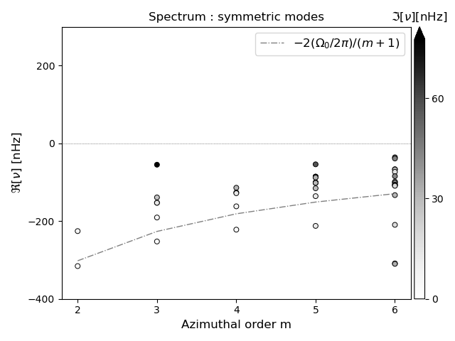
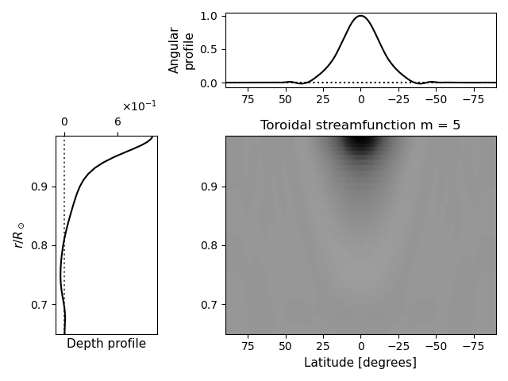

# RossbyWaveSpectrum.jl

A Julia code to compute the spectrum of inertial waves in the Sun.

# Installation
To install the code, run `./INSTALL.sh`. This requires `bash` and `curl` to run, and will download and install `julia` using the installer `juliaup`. It will also install the requisite project dependencies. The project uses Julia v1.10.1, which may be installed independently as well, in which case one only needs to instantiate the environments as listed in `INSTALL.sh`.

A part of installation process requires `matplotlib` to be available. If one is using an anaconda distribution located in their user directory, they may need to export `PYTHON=<path to python>` before running `INSTALL.sh`. So, for example, one may run
```
PYTHON=$HOME/anaconda3/bin/python ./INSTALL.sh
```
the first time the code is being installed (subsequent reinstallations will reuse the path that has been set). However, the code may be run without matplotlib as well, as it is only required for plotting the results.

Users running the code on a heterogeneous cluster (where the login and compute nodes have different CPU architectures) may want to set the environment variable `JULIA_CPU_TARGET` appropriately in their shell rc file. One may check the CPU architecture by running
```julia
julia> Sys.CPU_NAME
"skylake-avx512"
```
in the julia REPL on each node.

As an example, a valid setting may be
```
export JULIA_CPU_TARGET="generic;skylake-avx512,clone_all;icelake-server,clone_all"
```
if e.g. the login node has `skylake-avx512` and the compute node has `icelake-server`. Setting this is particularly important if one node has Intel processors whereas the other has AMD ones. This should be set before running `INSTALL.sh`.

# Starting Julia

Typically the code is run multi-threaded, so one needs to specify the number of threads while launching Julia.
As an example, if we want to use `5` Julia threads, this may be done as
```
julia +1.10.1 --project=. --startup-file=no -t 5
```
The flag `--project` should point to the path to the code.
The example above assumes that you are in the top-level code directory (`RossbyWaveSpectrum.jl`).

The flag `--startup-file=no` is optional, and may only be necessary if one has added a custom startup file that may interfere
with the code.

The flag `-t 5` indicates that `5` Julia threads are to be used.
Typically, we would want to use as many Julia threads as the number of azimuthal orders `m` that we want to solve for.
This ensures that all `m`s run in parallel.
Note that this differs from the number of BLAS threads that are used in solving the eigenvalue problem. If the code is
being run on a cluster, this is automatically inferred from the number of allocated cores and the number of Julia threads.
Alternately, this may be specified through the environment variable `MKL_NUM_THREADS`.

!!! note
	Currently, the code uses multi-threading and does not support distributed usage.
	Therefore one instance of the code must be launched on one node of a cluster.
	Distinct instances of the code that use different parameters may be run parallely on multiple nodes.

# Running the code

Before running the code, we would want to set the location where the output will be written to.
This is determined by the environment variable `SCRATCH`, which typically corresponds to a user's
scratch directory on a cluster. The output files will be written to `$SCRATCH/RossbyWaves`, and
the path will be created if it doesn't exist. Note that if `SCRATCH` is not specified, it will be set
to `homedir()` by default in the code.

The first step is to load the package
```julia
using RossbyWaveSpectrum
```

We start by computing the radial operators. We define some parameters:
```julia
nr, nℓ = 40, 20 # number of radial and latitudinal spectral coefficients
r_in_frac = 0.65 # inner boundary of the domain as a fraction of the solar radius
r_out_frac = 0.985 # outer boundary of the domain as a fraction of the solar radius
ν = 5e11 # kinematic viscosity coefficient in CGS units
trackingrate = :hanson2020 # track at 453.1 nHz; may also be a number in nHz
```
and compute the radial operators as
```julia
operators = radial_operators(nr, nℓ; r_in_frac, r_out_frac, ν, trackingrate)
```
Some of the common keyword arguments are demonstrated here.
There are various other keyword arguments which may be passed to specify domain and model details.
See [`radial_operators`](@ref) for details.

The second step is to obtain a function that will be used to compute the spectrum.
We need to specify whether we seek equatorially symmetric or antisymmetric solutions,
and the model of differential rotation that is used
(see [`RossbyWaveSpectrum.solar_differential_rotation_profile_derivatives_grid`](@ref) for details). We define some parameters
```julia
V_symmetric = true # indicates that V is symmetric about the equator, alternately set to `false` for antisymmetric
rotation_profile = :solar_latrad_squished # model of differential rotation to be used in the calculation
```
and compute the spectrum function as
```julia
spectrumfn! = RotMatrix(Val(:spectrum), V_symmetric, rotation_profile; operators)
```

Finally, we compute and save the spectrum for a range of azimuthal orders using the pre-defined parameters.
We define
```julia
mrange = 2:6 # the range of azimuthal orders for which to compute the spectra
```
and compute the spctrum using
```julia
save_eigenvalues(spectrumfn!, mrange; operators)
```
This will save the results to a file named `"solar_latrad_squished_nr40_nl20_sym.jld2"` in the output directory given by
`RossbyWaveSpectrum.DATADIR[]`. We may also specify filtering parameters as keyword arguments to `save_eigenvalues`, which will be passed on to [`filter_eigenvalues`](@ref). The filtering may be performed later as well, as a post-processing step.

# Loading the results

The results are stored in `jld2` files that are read in using the package `JLD2.jl`. We provide an interface to read these in:
```julia
julia> Feig = FilteredEigen(datadir("solar_latrad_squished_nr40_nl20_sym.jld2"))
Filtered eigen with m range = 2:6
```
This will load the solutions for all `m` into a struct that may be passed directly to the plotting functions. To obtain the solutions for one `m`, we may index into `Feig` with that `m`:
```julia
julia> Feig[2]
Filtered eigen with m = 2
```
The eigenvalues and eigenvectors for this `m` may be obtained as
```julia
julia> λs, vs = Feig[2];

julia> λs
4-element Vector{ComplexF64}:
 0.4981592422711335 + 0.014103483029526536im
 0.6967785422145395 + 0.00046298002829591573im
  1.469490820471635 + 0.06912096500018029im
 1.6005757491199637 + 0.03673314713783im
```
In the sign convention chosen in the code, a positive imaginary part of the eigenfrequencies indicates that the solutions are damped, and a positive real part indicates retrograde solutions. These are corrected for when plotting the solutions, so that the real part of the frequencies appear in the bottom right quadrant.

The `operators` and the parameters that were used to generate the solutions are saved in the `FilteredEigen` struct. The former is directly stored as `Feig.operators`, whereas the latter are stored in the field `kw`.
```julia
julia> Feig.kw
Dict{Symbol, Any} with 3 entries:
  :V_symmetric      => true
  :filterflags      => NODES|SPATIAL_RADIAL|SPATIAL_EQUATOR|BC|EIGVEC|EIGVAL|EIGEN
  :rotation_profile => :solar_latrad_squished
```

!!! warn
	The file format and types of contents may not be identical across releases, and backward compatibility is not always guaranteed. Please use the same version of the package that was used to create the file to read it back in.

## Filtering the solutions further

Occasionally, it might be necessary to filter the solution set further to reduce the number of modes retained in the spectrum. This may be done through the function `filter_eigenvalues`. As an example,
```julia
julia> Feig_filt = filter_eigenvalues(Feig, filterflags = Filters.SPATIAL, n_cutoff = 5);
```

For a full list of flags that may be passed to `filterflags`, check [`Filters`](@ref). For the filter parameters that may be passed as keyword arguments, check the keys of [`RossbyWaveSpectrum.DefaultFilterParams`](@ref). This also lists the default values that are used when computing the solutions.

# Plotting the results

The plotting functions are provided by the module `RossbyPlots`. This resides in a separate environment, which must be activated first using
```julia
julia> import Pkg

julia> Pkg.pkg"activate RossbyPlots"
```
Alternately, one may press the `]` key from the julia REPL to enter the interactive `Pkg` mode, and execute
```julia
(RossbyWaveSpectrum) pkg> activate RossbyPlots
  Activating project at [...]

(RossbyPlots) pkg>
```
and finally press the backspace key to get back to the REPL prompt.

The plotting functions use `matplotlib`, which must be available on the system, and accessible to `PyPlot`. The plots shown here were generated using matplotlib version 3.4.3. See the [installation](#Installation) section on instructions to set this up if necessary.

We may plot the spectrum as
```julia
julia> using RossbyPlots

julia> spectrum(Feig_filt)
```

This will produce the following plot:



We find several ridges of eigenvalues.
!!! note
	By default, the plot zooms into a region near the rossby ridge frequency ``-2(\Omega_0/2\pi)/(m+1)``, so one may
	need to zoom out to look at eigenvalues that are not visible in this plot

We may plot one eigenvector — e.g. the ``12``th eigenvector corresponding to ``m=5`` — as
```julia
julia> eigenfunction(Feig, 5, 12)
```
This produces the following plot:



By default, this plots the real part of `V`, but the field and component to be plotted may be specified through parameters to `eigenfunction`. Alternately, all the components of all the fields may be plotted using `eigenfunctions_allstreamfn`.

Help on the plotting functions is available in the REPL, which may be accessed through the `?` key. So e.g. `?spectrum` will display a detailed list of parameters that may be passed to `spectrum`.
